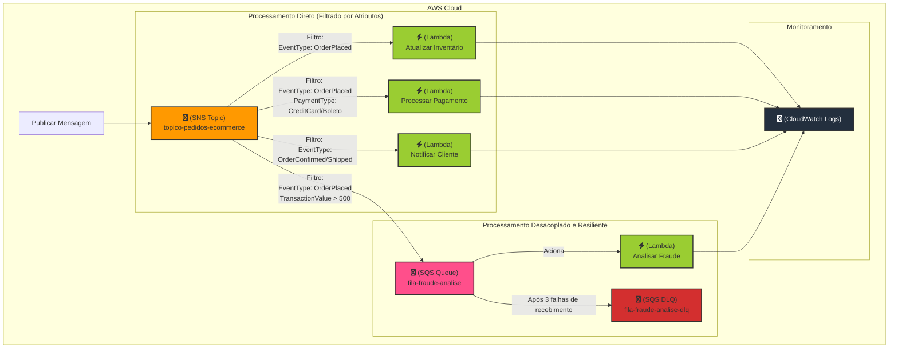

# 🚀 Laboratório de Arquitetura Fan-Out com AWS (SNS, SQS, Lambda)

  

Este repositório contém o guia e os recursos para implementar uma arquitetura de processamento de eventos distribuída e resiliente na AWS, utilizando o padrão **Fan-Out**.

##  Cenário: Processamento de Pedidos de E-commerce

Imagine que um cliente finaliza um pedido em um site de e-commerce. Uma única ação precisa desencadear múltiplos processos de negócios que podem (e devem) rodar em paralelo para garantir uma experiência rápida e confiável para o cliente. 
Este laboratório simula exatamente isso, orquestrando as seguintes ações:
* ✅ **Atualização de Inventário** 
* 💳 **Processamento de Pagamento** 
* 📧 **Notificação ao Cliente** 
* 🛡️ **Análise de Fraude (para transações de alto valor)** 

## 🏗️ Diagrama da Arquitetura




O fluxo funciona da seguinte forma:
1.  Um evento de pedido é publicado em um **tópico SNS**.
2.  O SNS distribui (fan-out) a mensagem para múltiplos assinantes.
3.  **Funções Lambda** inscritas no tópico são acionadas DIRETAMENTE, usando **filtros de assinatura** para atuar apenas em eventos relevantes. 
4.  Uma **fila SQS** também está inscrita no tópico (com um filtro específico para pedidos de alto valor), desacoplando uma tarefa mais demorada. 
5.  Uma função Lambda processa as mensagens da fila SQS de forma assíncrona. 
6.  Uma **Dead-Letter Queue (DLQ)** é configurada para capturar quaisquer falhas de processamento na fila principal, aumentando a resiliência. 
## 💡 Conceitos Fundamentais

<details>
  <summary><strong>Amazon SNS (Simple Notification Service)</strong></summary>
  <p>Atua como um hub de mensagens pub/sub. Usamos um tópico SNS como ponto de entrada único para distribuir uma mensagem para múltiplos endpoints (Lambdas, SQS) de forma paralela.  A funcionalidade de <b>Filtro de Assinatura</b> é crucial aqui, permitindo que cada assinante defina uma política para receber apenas as mensagens que lhe interessam. </p>
</details>

<details>
  <summary><strong>Amazon SQS (Simple Queue Service)</strong></summary>
  <p>Funciona como um buffer resiliente que desacopla os componentes.  Ao colocar mensagens em uma fila, garantimos que elas não se percam caso o serviço consumidor (nossa Lambda de análise de fraude) esteja temporariamente indisponível. A <b>Dead-Letter Queue (DLQ)</b> é nossa rede de segurança para isolar e analisar mensagens que falharam no processamento repetidamente. </p>
</details>

<details>
  <summary><strong>AWS Lambda</strong></summary>
  <p>Fornece o poder de computação serverless.  As funções são acionadas por eventos do SNS (diretamente) ou do SQS (indiretamente), executando uma lógica de negócio específica sem a necessidade de gerenciar servidores.</p>
</details>

## 🛠️ Serviços Utilizados

* **SNS (Simple Notification Service)**
* **SQS (Simple Queue Service)**
* **Lambda**
* **IAM (Identity and Access Management)** 
* **CloudWatch (para Logs e Monitoramento)** 

## 🚀 Passos para Implementação

O laboratório consiste nos seguintes passos de alto nível:

- [ ] **1. Configurar Filas SQS:** Criar a fila principal (`fila-fraude-analise`) e sua respectiva Dead-Letter Queue (DLQ). 
- [ ] **2. Criar Tópico SNS:** Configurar o tópico central (`topico-pedidos-ecommerce`) que orquestrará o fan-out. 
- [ ] **3. Configurar Papéis IAM:** Criar os papéis com as permissões necessárias para que as Lambdas possam executar e interagir com outros serviços da AWS. 
- [ ] **4. Criar Funções Lambda:** Desenvolver as quatro funções Python para cada lógica de negócio. 
- [ ] **5. Criar as Assinaturas (Subscriptions):** Conectar as Lambdas e a fila SQS ao tópico SNS, **configurando as políticas de filtro** para cada uma. 
- [ ] **6. Testar a Arquitetura:** Publicar uma mensagem de teste no tópico SNS com atributos específicos para validar o acionamento seletivo dos componentes. 
- [ ] **7. Monitorar e Verificar:** Usar o CloudWatch Logs para confirmar que cada parte do sistema se comportou como esperado. 
- [ ] **8. Limpeza de Recursos:** Excluir todos os recursos criados para evitar cobranças. 

## 🧪 Testando o Fluxo

Para testar, publique uma mensagem no tópico SNS com o corpo e os atributos a seguir. Os atributos são **essenciais** para que os filtros de assinatura funcionem!

**Corpo da Mensagem (Message Body):**
```json
{
  "pedido_id": "PEDIDO-123",
  "cliente_id": "CLIENTE-XYZ",
  "itens": [
    {"produto_id": "PROD-A", "quantidade": 2},
    {"produto_id": "PROD-B", "quantidade": 1}
  ]
}
```
## Parabéns por concluir este laboratório avançado de arquitetura fan-out com SNS, SQS e Lambda!
Você demonstrou um excelente entendimento de como construir sistemas
distribuídos e orientados a eventos na AWS.