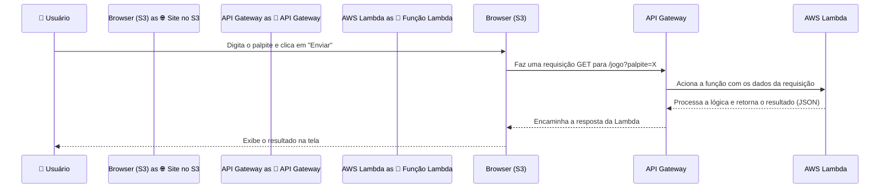

# 🎮 Jogo de Adivinhação Serverless com AWS 🎮

  

Bem-vindo a este laboratório prático! Aqui você vai construir um **Jogo de Adivinhação** totalmente funcional e 100% serverless na nuvem da AWS. É o projeto perfeito para entender na prática como os principais serviços da AWS se conectam.

## ✨ Tecnologias Utilizadas

-   🧠 **AWS Lambda:** Para executar nossa lógica de jogo em Python sem pensar em servidores.  Contém a função lambda_function.py, que é o cérebro do jogo. Gera um número aleatório, compara com o palpite do usuário (recebido via query string da API) e retorna uma resposta em formato JSON.
-   🔗 **Amazon API Gateway:** Para criar um endpoint HTTP seguro que conecta nosso site à função Lambda. Cria uma API RESTful com um método GET na rota /jogo. Atua como um gatilho (trigger) para a função Lambda. Gerencia as configurações de CORS para permitir requisições do frontend hospedado no S3. 
-   🌐 **Amazon S3:** Para hospedar nosso site estático de forma barata, escalável e acessível globalmente. Hospeda a página index.html e outros assets estáticos. Configurado para servir como um website estático. Uma política de bucket é aplicada para permitir acesso público de leitura (s3:GetObject).

## 🏗️ Arquitetura da Aplicação

O fluxo é simples e poderoso: o usuário interage com o site no S3, que chama a API Gateway, que por sua vez aciona a função Lambda para processar a jogada e retornar o resultado. 

## 🛠️ Passos para a Construção (Resumo do Laboratório)

1 - Configurar a Função Lambda:

- Criar uma nova função Lambda com runtime Python 3.9. 
- Fazer o upload do código lambda_function.py contido neste repositório. 

2 - Criar a API no API Gateway:

- Criar uma API HTTP. 
- Integrar a API com a função Lambda criada no passo anterior. 
- Configurar uma rota GET /jogo. 
- Habilitar CORS para permitir acesso de qualquer origem (*). 

3 - Hospedar o Frontend no S3:

- Criar um bucket S3 com um nome único. 
- Atualizar o arquivo index.html com a URL da sua API Gateway. 
- Fazer o upload do index.html para o bucket. 
- Habilitar o "Static website hosting" nas propriedades do bucket. 
- Liberar o acesso público e aplicar a política de bucket correta para permitir que todos leiam os objetos.
---------

🏆 Laboratório Concluído!
Parabéns por chegar até aqui!  Se você gostou deste projeto, que tal deixar uma ⭐ no repositório?