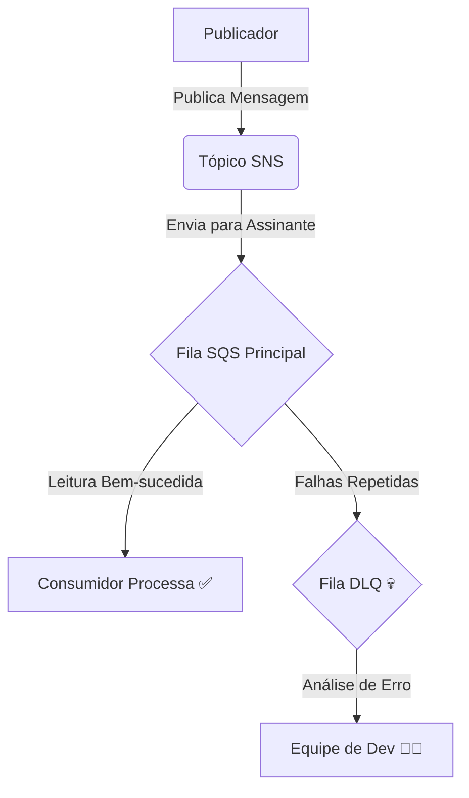

# 🚀 Projeto de Mensageria Resiliente com AWS SNS e SQS

Este repositório documenta a implementação de um sistema de mensageria desacoplado e tolerante a falhas na AWS, utilizando SNS para publicação de eventos, SQS para consumo em filas e uma Dead-Letter Queue (DLQ) para tratamento de erros.

## 🏛️ Arquitetura

O fluxo de trabalho foi desenhado para maximizar o desacoplamento e a resiliência entre microsserviços:

1.  **Publicador (Publisher)**: Um serviço (ou usuário via console AWS) publica uma mensagem em um **Tópico SNS Padrão**. 
2.  **Inscrição (Subscription)**: Uma **Fila SQS Principal** está inscrita neste tópico SNS, recebendo todas as mensagens publicadas. 
3.  **Processamento Falho (Simulação)**: Um consumidor tenta processar uma mensagem da fila principal, mas falha repetidamente.
4.  **Política de Redirecionamento (Redrive Policy)**: Após um número pré-configurado de tentativas de leitura falhas (ex: 3 vezes), a Fila SQS Principal move automaticamente a mensagem "envenenada" para uma segunda fila. 
5.  **Análise de Falhas**: A mensagem é isolada na **Fila de Mensagens Mortas (Dead-Letter Queue - DLQ)**, onde pode ser analisada por uma equipe de desenvolvimento sem impactar o fluxo principal de mensagens. 



## 🛠️ Configuração do Ambiente

Este projeto foi construído inteiramente no Console de Gerenciamento da AWS. Os seguintes recursos foram criados e configurados:

### 1. Filas SQS

-   **Fila DLQ (`minha-dlq-lab-...`)**: Uma fila SQS Padrão simples, criada primeiro para que seu ARN pudesse ser utilizado na fila principal. 
-   **Fila Principal (`minha-fila-principal-lab-...`)**: Uma fila SQS Padrão com a seção **Dead-letter queue** habilitada e configurada para: 
    -   Apontar para o ARN da nossa DLQ. 
    -   Definir o `Maximum receives` para `3`. 

### 2. Tópico SNS

-   **Tópico (`meu-topico-lab-...`)**: Um Tópico SNS Padrão foi criado para servir como o ponto central de publicação de eventos. 

### 3. Conexão e Permissões

-   **Inscrição SNS**: A Fila SQS Principal foi inscrita no Tópico SNS. 
-   **Política de Acesso da Fila SQS**: Uma política JSON foi anexada à fila principal para permitir explicitamente que o serviço SNS (`sns.amazonaws.com`) executasse a ação `sqs:SendMessage`, condicionada ao ARN do nosso tópico.

    <details>
    <summary>Clique para ver o exemplo da Política JSON</summary>

    ```json
    {
      "Version": "2012-10-17",
      "Statement": [
        {
          "Sid": "Allow-SNS-SendMessage",
          "Effect": "Allow",
          "Principal": {
            "Service": "sns.amazonaws.com"
          },
          "Action": "sqs:SendMessage",
          "Resource": "<ARN_DA_FILA_PRINCIPAL>",
          "Condition": {
            "ArnEquals": {
              "aws:SourceArn": "<ARN_DO_TÓPICO_SNS>"
            }
          }
        }
      ]
    }
    ```
    </details>

## 🧪 Como Testar

### Teste 1: Fluxo Feliz

1.  Acesse o Console SNS e selecione o tópico criado.
2.  Clique em **"Publicar mensagem"**. 
3.  Envie uma mensagem JSON de teste.
4.  Acesse o Console SQS, selecione a **fila principal** e clique em **"Sondar mensagens"**. 
5.  **Resultado esperado**: A mensagem publicada via SNS deve aparecer na fila SQS. 

### Teste 2: Simulação de Falha e Envio para a DLQ

1.  Certifique-se de que a mensagem do teste anterior ainda está na fila (ou publique uma nova).
2.  Na fila principal, clique em **"Sondar mensagens"** para visualizar a mensagem. **Não a exclua**.  O contador de recebimentos (`Receive count`) será `1`. 
3.  Aguarde o tempo limite de visibilidade da fila (padrão: 30 segundos) expirar. 
4.  Sonde as mensagens novamente. O `Receive count` será `2`. 
5.  Repita o processo. Na terceira sondagem, o `Receive count` será `3`. 
6.  Após o tempo limite de visibilidade expirar mais uma vez, a mensagem desaparecerá da fila principal. 
7.  **Resultado esperado**: Navegue até a **fila DLQ**, sonde as mensagens e a mensagem original estará lá, pronta para inspeção. 

## 🧹 Limpeza

> **Importante**: Para evitar custos inesperados, lembre-se de excluir todos os recursos criados ao final dos testes.

1.  Exclua a **Assinatura SNS**. 
2.  Exclua o **Tópico SNS**. 
3.  Exclua a **Fila SQS Principal**. 
4.  Exclua a **Fila SQS DLQ**.